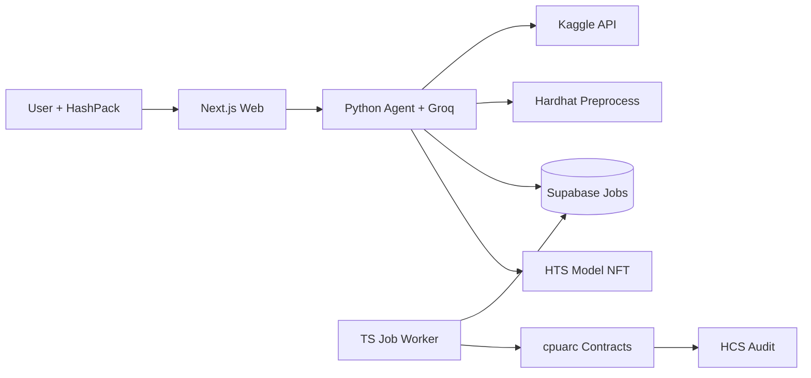
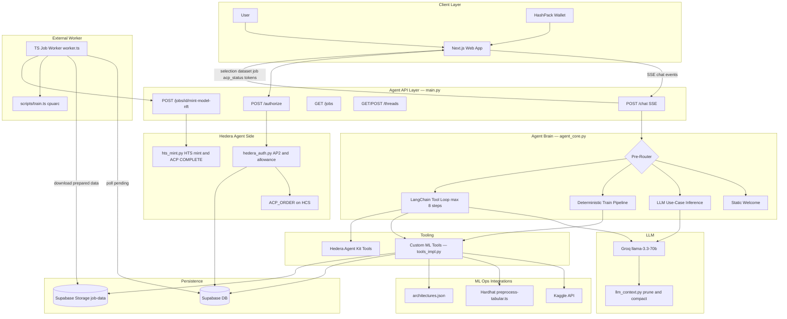
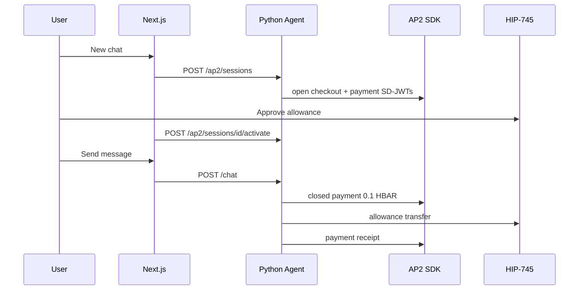
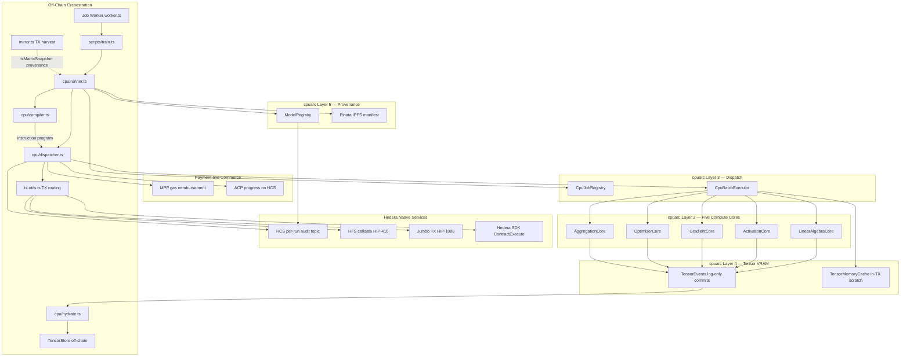
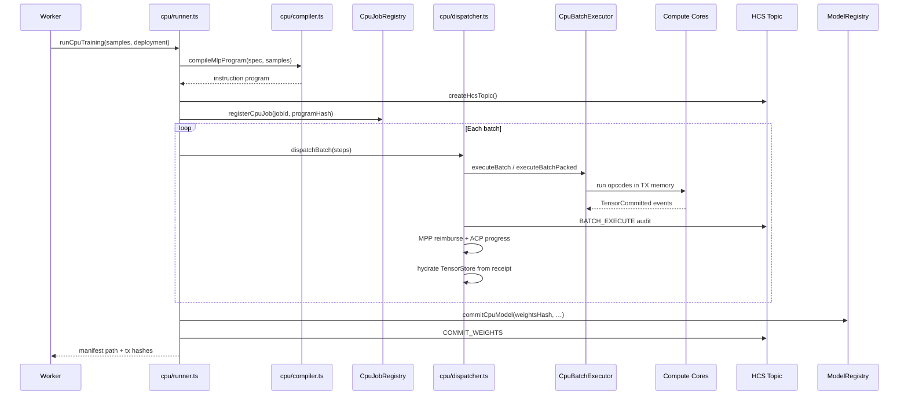

# POCU — On-Chain CPU

**POCU** is a Hedera-native agentic machine-learning platform that turns natural language into **fully auditable, on-chain tabular model training**. A conversational AI agent discovers datasets autonomously, preprocesses tabular data, queues training jobs, and coordinates wallet-authorized gas spend—while a separate worker executes real tensor operations inside Solidity smart contracts on Hedera testnet. The deliverable is not a PDF or a promise: it is an **ACTUAL ML MODEL** with a HTS model NFT backed by on-chain hashes, HCS audit messages, and IPFS manifest pinning.

> *On-Chain CPU — Hedera tensor compute engine (cpuarc)*

---

## Important Links

| Resource | Link |
|----------|------|
| Live Demo | [View](https://pocu-demo.example.com) |
| Demo Video | [View](https://youtu.be/pocu-demo-placeholder) |
| Pitch Deck | [View](https://docs.google.com/presentation/d/pocu-deck-placeholder) |

*Replace placeholder URLs before hackathon submission.*

---

## Deployed Contracts

| Contract | Network | Address |
|----------|---------|---------|
| `CpuJobRegistry` | Hedera testnet | [`0xE6aa3cc8cE128fef0731cea6dAd9cC83a34bc4d1`](https://hashscan.io/testnet/contract/0xE6aa3cc8cE128fef0731cea6dAd9cC83a34bc4d1) |
| `CpuBatchExecutor` | Hedera testnet | [`0x374184e818e8fc759E75f02694b6973339eC1aaF`](https://hashscan.io/testnet/contract/0x374184e818e8fc759E75f02694b6973339eC1aaF) |
| `ModelRegistry` | Hedera testnet | [`0xe28fa5222bf04bE12eD0A707409ecA21B28cAC80`](https://hashscan.io/testnet/contract/0xe28fa5222bf04bE12eD0A707409ecA21B28cAC80) |
| `LinearAlgebraCore` | Hedera testnet | [`0x552b7463A82823113Bf6c4fB10562F50A29170Ac`](https://hashscan.io/testnet/contract/0x552b7463A82823113Bf6c4fB10562F50A29170Ac) |
| `ActivationCore` | Hedera testnet | [`0xf74C88E243453FaE52B42744B56897e6AB327516`](https://hashscan.io/testnet/contract/0xf74C88E243453FaE52B42744B56897e6AB327516) |
| `GradientCore` | Hedera testnet | [`0xeE40905155B15947bc8A2da889596EE9253506B3`](https://hashscan.io/testnet/contract/0xeE40905155B15947bc8A2da889596EE9253506B3) |
| `OptimizerCore` | Hedera testnet | [`0x4B3C6aDCd6F6F5439c3Ead8C2DBAeCf8A1B089E6`](https://hashscan.io/testnet/contract/0x4B3C6aDCd6F6F5439c3Ead8C2DBAeCf8A1B089E6) |
| `AggregationCore` | Hedera testnet | [`0xec0f13F9b5ceb6c8E4EbD7E58dc43B3b34FdA348`](https://hashscan.io/testnet/contract/0xec0f13F9b5ceb6c8E4EbD7E58dc43B3b34FdA348) |
| POCU Model NFT (HTS) | Hedera testnet | [`0.0.9211401`](https://hashscan.io/testnet/token/0.0.9211401) |
| Shared HCS topic (ACP) | Hedera testnet | [`0.0.9191580`](https://hashscan.io/testnet/topic/0.0.9191580) |

> **Note:** Each training run also creates a **dedicated HCS audit topic** (stored on the job row as `hcs_topic_id`). The shared topic above is used for ACP order visibility. Agent operator account: `0.0.6111100` (`ACCOUNT_ID` in `.env`).

---

## Table of Contents

1. [Introduction](#1-introduction)
2. [The Problem We Are Solving](#2-the-problem-we-are-solving)
3. [The Solution](#3-the-solution)
4. [The Agent](#4-the-agent)
   - [4.1 Vision & Impact](#41-vision--impact)
   - [4.2 Architecture Overview](#42-architecture-overview)
   - [4.3 Conversational Orchestration](#43-conversational-orchestration)
   - [4.4 Tooling & Capabilities](#44-tooling--capabilities)
   - [4.5 LLM & Context Management](#45-llm--context-management)
   - [4.6 Wallet-Authorized Commerce Flow](#46-wallet-authorized-commerce-flow)
   - [4.7 Deployment Topology](#47-deployment-topology)
5. [Interoperability Protocols](#5-interoperability-protocols)
   - [5.1 Overview](#51-overview)
   - [5.2 AP2 — Agent Payment Mandate](#52-ap2--agent-payment-mandate)
   - [5.3 MPP — Mandate Payment Protocol](#53-mpp--mandate-payment-protocol)
   - [5.4 ACP — Agent Commerce Protocol](#54-acp--agent-commerce-protocol)
   - [5.5 End-to-End Protocol Flow](#55-end-to-end-protocol-flow)
6. [Hedera Integrations](#6-hedera-integrations)
   - [6.1 Hedera EVM & Smart Contracts](#61-hedera-evm--smart-contracts)
   - [6.2 HCS — Consensus & Audit Trail](#62-hcs--consensus--audit-trail)
   - [6.3 HTS — Model NFT Deliverables](#63-hts--model-nft-deliverables)
   - [6.4 HFS & Jumbo Transactions (HIP-410 / HIP-1086)](#64-hfs--jumbo-transactions-hip-410--hip-1086)
   - [6.5 HBAR Allowances (HIP-745)](#65-hbar-allowances-hip-745)
   - [6.6 Mirror Node](#66-mirror-node)
   - [6.7 HashPack / WalletConnect Authorization](#67-hashpack--walletconnect-authorization)
7. [On-Chain CPU (cpuarc)](#7-on-chain-cpu-cpuarc)
   - [7.1 cpuarc Layer Model](#71-cpuarc-layer-model)
   - [7.2 Instruction Set & Five Compute Cores](#72-instruction-set--five-compute-cores)
   - [7.3 Job Registry & Batch Executor](#73-job-registry--batch-executor)
   - [7.4 Tensor VRAM Protocol (Event-Only State)](#74-tensor-vram-protocol-event-only-state)
   - [7.5 Weight Initialization & Ledger Provenance](#75-weight-initialization--ledger-provenance)
   - [7.6 Model Registry & Provenance](#76-model-registry--provenance)
   - [7.7 Off-Chain Hydration, IPFS & Manifest](#77-off-chain-hydration-ipfs--manifest)
   - [7.8 Training Pipeline (End-to-End)](#78-training-pipeline-end-to-end)
   - [7.9 Calldata Engineering & Hedera TX Routing](#79-calldata-engineering--hedera-tx-routing)
8. [Conclusion](#8-conclusion)

---

## 1. Introduction

We are entering an era where AI agents do not merely *answer questions*—they *execute missions*. They find data, spend budgets, deliver artifacts, and must prove every step. **POCU** is built for that future on Hedera: the first conversational interface that turns plain English into **ledger-executed machine learning** with cryptographic provenance from first byte to final NFT.

The elevator pitch is simple:

> **User speaks → agent finds relevant datasets → preprocesses → queues job → worker runs tensor ops in Solidity → user receives an HTS model NFT with cryptographic proof.**

This is not "ML with blockchain payments bolted on." This is **ML as ledger execution**—matrix multiplications, activations, loss gradients, and optimizer steps running on Hedera, audited on HCS, committed to a `ModelRegistry`, and delivered as a non-fungible token the user actually owns.

POCU combines three breakthroughs in one stack:

1. **A conversational training coordinator** powered by Groq LLMs and LangChain tool-calling—not a chatbot, but an autonomous ML ops agent.
2. **POCU-defined interoperability protocols** (AP2, MPP, ACP) that let agents spend user-authorized HBAR safely while publishing an auditable commerce lifecycle on HCS.
3. **cpuarc**—an on-chain compute engine: a fixed-point tensor instruction set, five Solidity compute cores, and a batch executor that turns Hedera transactions into verifiable training steps.


---

## 2. The Problem We Are Solving

Three massive gaps intersect in modern AI—and POCU closes all three simultaneously.

### The Trust Gap

Machine learning models are black boxes. When a bank deploys a fraud detector, a hospital screens for heart disease, or a telco predicts churn, stakeholders ask: *Where did this model come from? Who trained it? On what data? Can we prove it wasn't tampered with?*

Traditional ML pipelines offer logs at best. POCU offers **ledger-grade provenance**: every training batch emits HCS audit messages; final weights are hashed and committed on-chain; the deliverable is an HTS NFT whose metadata points to immutable proof.

### The Access Gap

Building even a simple tabular classifier requires: finding a dataset, cleaning CSVs, choosing architecture, writing preprocessing code, provisioning compute, and deploying artifacts. Non-ML users—product managers, domain experts, entrepreneurs—are locked out.

POCU's agent accepts intents like **"build a fraud detection model"** or **"predict customer churn"** and handles dataset discovery, architecture selection, preprocessing, and job queueing in a single conversational flow. Supported use-case includes fraud detection, heart disease screening, customer churn, credit default risk, diabetes prediction, spam detection, demand forecasting, and predictive maintenance.

### The Agent Commerce Gap

AI agents that can *think* are useless if they cannot *spend*—safely, transparently, within user-defined budgets. Who pays for on-chain gas? How does the user retain control? How is spend auditable?

POCU answers with three composable protocols layered on Hedera primitives:

| Gap | Pain | POCU Answer |
|-----|------|-------------|
| **Trust** | Black-box models, no provenance | HCS audit + on-chain hashes + NFT deliverable |
| **Access** | ML requires pipelines, infra, expertise | Conversational agent + Kaggle discovery |
| **Agent commerce** | Agents cannot safely spend user funds at scale | AP2 mandate + HBAR allowance + MPP + ACP order lifecycle |

The result: a user connects HashPack, signs a budget mandate, chats with an agent, and receives a verifiable on-chain model—all without surrendering custody of their wallet or blind-trusting an opaque API.

---

## 3. The Solution

POCU is a **three-service platform** orchestrated through Supabase and Hedera testnet.

### Platform Components

| Service | Location | Role |
|---------|----------|------|
| **Web UI** | [`web/`](web/) | Next.js chat interface, HashPack wallet gate, structured SSE cards (dataset picks, job links, ACP progress) |
| **Agent** | [`agent/`](agent/) | FastAPI + LangChain + Groq coordinator; job creation; HTS mint callback |
| **Job Worker** | [`src/jobs/worker.ts`](src/jobs/worker.ts) | Polls Supabase for pending jobs; spawns Hardhat training; uploads manifest; triggers NFT mint |

### Data Path

```
Natural language intent
  → Agent infers use case + MLP architecture
  → Kaggle CSV discovery and download
  → preprocess-tabular.ts (Pearson feature selection, z-score normalization, fixed-point encoding)
  → Supabase storage bucket "job-data" (prepared.csv + meta.json)
  → scripts/train.ts → src/cpu/runner.ts
  → cpuarc on-chain execution
```

[`src/preprocess-tabular.ts`](src/preprocess-tabular.ts) auto-detects target columns, validates task type against the architecture template, selects top correlated numeric features, and writes a SHA-256 `dataHash` over processed samples.

### Deliverable Path

```
ModelRegistry.commitCpuModel() — on-chain hash commitment
  → Optional Pinata IPFS manifest pin
  → agent/hts_mint.py — HTS NFT mint + transfer to user wallet
  → ACP_STATUS: COMPLETE on HCS
```

The user ends with an **HTS model NFT**—a tangible, transferable artifact representing their trained model, not a database row.

### Why Hedera

- **Fast finality** — training batches confirm quickly on testnet
- **Native HCS** — immutable audit trail without wrapping external indexers
- **Native HTS** — model deliverables as first-class tokens
- **Native HFS** — oversized calldata via file references (HIP-410)
- **EVM compatibility** — Solidity compute cores with standard Hardhat tooling
- **HBAR allowances (HIP-745)** — delegated agent spend without custodial wallets

### Demo Constraints

> **POC envelope (hackathon demo):** Training defaults to **2 samples** and **1 epoch** on Hedera testnet. Only **tabular MLP** architectures are supported (classification and regression). These limits keep testnet demos fast and affordable while proving the full pipeline end-to-end. See [`agent/architectures.json`](agent/architectures.json) for the MLP catalog.

---

## 4. The Agent

### 4.1 Vision & Impact

The POCU agent is **the missing UX layer for autonomous on-chain compute**. It is not a chatbot that explains ML—it is a **training coordinator** that closes the entire loop from natural-language intent to HTS model NFT.

**Why this matters:**

- **Democratizes ML** — Domain experts describe goals in plain English; the agent handles Kaggle search, preprocessing, architecture matching, and job queueing.
- **Enables auditable AI commerce** — Every chat session gets a real AP2 mandate pair, budget cap, and payment receipts on Hedera.
- **Proves agents can spend safely** — AP2 mandates and HBAR allowances let autonomous agents reimburse gas from pre-approved budgets without custodial risk.
- **Makes ledger compute usable** — Without the agent, cpuarc is a low-level tensor engine. With it, anyone can say *"train a fraud model on this dataset"* and get an on-chain job.

This is the interface layer that turns Hedera from a ledger into a **compute platform ordinary humans can actually use**.

### 4.2 Architecture Overview

The agent is a **FastAPI** application ([`agent/main.py`](agent/main.py)) exposing REST and SSE endpoints. The Next.js web app proxies chat requests and renders structured streaming events as rich UI cards.

#### Key Endpoints

| Endpoint | Method | Purpose |
|----------|--------|---------|
| `/chat` | POST (SSE) | Main conversational interface; requires active AP2 session; settles 0.1 HBAR per reply |
| `/ap2/sessions` | POST | Create open checkout + payment mandate pair for a chat thread |
| `/ap2/sessions/{id}/activate` | POST | Verify HIP-745 allowance; activate session |
| `/ap2/sessions/{id}/settle` | POST | Internal batch/chat settlement (closed mandate + transfer) |
| `/architectures` | GET | Returns MLP architecture catalog |
| `/jobs` | GET | Lists training jobs for connected wallet |
| `/jobs/{id}` | GET | Job status, logs, on-chain metadata |
| `/jobs/estimate-cost` | GET | Cost estimate vs 200 HBAR budget cap |
| `/jobs/{id}/mint-model-nft` | POST | HTS mint after worker completes training |
| `/threads` | GET/POST | Chat thread CRUD |
| `/threads/{id}` | GET/PATCH | Thread messages and metadata |
| `/health` | GET | Health check for Cloud Run |

Structured SSE events drive the UI: `selection`, `dataset` / `datasets`, `job`, `job_progress` (training pipeline), streaming `text`, and `ap2_settlement` after each assistant reply.

#### Full Agent Architecture



*End-to-end agent architecture — conversational orchestration, dual tool stacks (custom ML + Hedera Agent Kit), Supabase job queue, and worker-triggered on-chain training.*

### 4.4 Tooling & Capabilities

The agent wields **two complementary tool stacks**—custom ML operations and native Hedera ledger tools.

#### Custom ML Tools

Implemented in [`agent/tools_impl.py`](agent/tools_impl.py) as LangChain `@tool` decorators:

| Tool | Role |
|------|------|
| `list_architectures_tool` | Returns MLP catalog from `architectures.json` |
| `search_kaggle_datasets` | CSV dataset search; `list_mode`: `"best"` or `"all"` |
| `inspect_kaggle_dataset_tool` | File list + size guard (≤500 MB) |
| `download_and_prepare_dataset` | Download → subprocess `hardhat run scripts/preprocess-tabular.ts` |
| `trigger_training_job_tool` | Insert Supabase `training_jobs` row + upload to storage |
| `get_training_job` | Poll job status and logs |

#### Hedera Agent Kit

Loaded in [`agent/agent_core.py`](agent/agent_core.py) via `HederaLangchainToolkit` on Hedera testnet in **AUTONOMOUS** mode:

| Plugin | Capability |
|--------|------------|
| `core_account_query_plugin` | Account balance and info queries |
| `core_consensus_plugin` | HCS message submission |
| `core_token_plugin` | HTS token operations |
| `core_token_query_plugin` | Token balance and metadata queries |

The Hedera Agent Kit is the **bridge between conversational AI and Hedera state**—letting the agent check operator balance before training, submit HCS audit messages, and interact with tokens natively alongside custom ML tools. Requires `ACCOUNT_ID` + `PRIVATE_KEY`; gracefully degrades if Agent Kit initialization fails.

### 4.6 AP2 Session Flow (Wallet)

Each **new chat** requires an AP2 session before the composer is enabled ([`web/components/Ap2SetupGate.tsx`](web/components/Ap2SetupGate.tsx), [`web/lib/wallet/ap2-session.ts`](web/lib/wallet/ap2-session.ts)):

1. **Create session** — Agent builds real open checkout + open payment SD-JWTs via the [Google AP2 Python SDK](https://github.com/google-agentic-commerce/AP2) (`agent/pocu_ap2/`)
2. **Approve HBAR allowance** — HashPack `AccountAllowanceApproveTransaction` (default 200 HBAR)
3. **Activate** — `POST /ap2/sessions/{id}/activate`; [`agent/hedera_auth.py`](agent/hedera_auth.py) verifies allowance on the mirror node

Optional before training: **associate MODEL NFT token** (HTS requirement, separate from AP2).

Settlement:

- **Each agent reply** → 0.1 HBAR via closed payment mandate + HIP-745 transfer + payment receipt
- **Each training batch** → actual EVM gas cost, settled by [`src/protocols/ap2-settle.ts`](src/protocols/ap2-settle.ts) calling the agent

See [`AP2_INTEGRATION.md`](AP2_INTEGRATION.md) for SDK install (`ap2 @ git+https://github.com/google-agentic-commerce/AP2.git@main`) and Hedera payment-instrument extension details.

---

## 5. AP2 Payments (Google Agent Payments Protocol)

POCU uses the **real AP2 SDK** — not custom JSON mandates. The adapter lives in [`agent/pocu_ap2/`](agent/pocu_ap2/) and installs the upstream package from GitHub (see [`agent/requirements.txt`](agent/requirements.txt)).

### 5.1 Mandate pair (per chat session)

| Artifact | Role |
|----------|------|
| Open checkout mandate | Line item: POCU chat + on-chain ML training |
| Open payment mandate | Budget, amount range, allowed payee, payment instrument, checkout reference |
| Closed payment mandate | One per charge (chat turn or training batch) |
| Payment receipt | JWT bound to closed mandate + Hedera tx id |

Trusted-surface keys sign open mandates after UI consent; the agent signing key (`cnf.jwk`) signs closed payments.

### 5.2 Hedera HBAR extension

HBAR is not ISO-4217. POCU uses `PaymentInstrument.type = "hedera_hbar_allowance"` with amounts in **tinybars**. Cumulative budget is enforced by `HederaBudgetEvaluator` in [`agent/pocu_ap2/constraints_hedera.py`](agent/pocu_ap2/constraints_hedera.py).

### 5.3 Charges

| Event | Amount | Reason |
|-------|--------|--------|
| Agent chat reply | 0.1 HBAR | `chat_turn` |
| Training batch | Actual EVM gas (wei → HBAR) | `training_batch_{n}` |

### 5.4 Database

Run [`scripts/sql/ap2-sessions-migration.sql`](scripts/sql/ap2-sessions-migration.sql): tables `ap2_sessions`, `ap2_payment_receipts`, and `training_jobs.ap2_session_id`.

### 5.5 End-to-end flow



---

## 6. Hedera Integrations

POCU is built **Hedera-native**—not a generic EVM fork with Hedera bolted on. This section covers native Hedera services. The **Hedera Agent Kit** LangChain integration is documented in [§4.4](#44-tooling--capabilities).

### 6.1 Hedera EVM & Smart Contracts

**What:** Solidity smart contracts deployed to Hedera testnet (chainId 296) executing fixed-point tensor operations.

**Why:** Hedera's EVM compatibility lets us use Hardhat, ethers.js, and standard Solidity patterns while benefiting from Hedera's consensus finality and native service integration.

**Where:**

| Artifact | Path |
|----------|------|
| Compute contracts | [`contracts/`](contracts/) |
| Hardhat config | [`hardhat.config.ts`](hardhat.config.ts) — RPC `https://testnet.hashio.io/api`, 15M gas limit |
| Deploy script | [`scripts/deploy.ts`](scripts/deploy.ts) → `deployments/testnet.json` |
| Training entry | [`scripts/train.ts`](scripts/train.ts) |

Eight EVM contracts form the cpuarc training stack (detailed in [§7](#7-on-chain-cpu-cpuarc)).

### 6.2 HCS — Consensus & Audit Trail

**What:** Hedera Consensus Service topics carrying structured audit messages for every training run.

**Why:** Immutable, timestamped, ordered message log—perfect for ML provenance without external indexers.

**Where:** [`src/hcs.ts`](src/hcs.ts)

#### Message Types

| Message | When |
|---------|------|
| `PROGRAM_START` | Training program compiled and registered |
| `BATCH_EXECUTE` | Each batch dispatched to `CpuBatchExecutor` |
| `INSTRUCTION` | Optional per-instruction audit (`CPU_HCS_BATCH_AUDIT=1`) |
| `PROGRAM_END` | All batches complete |
| `COMMIT_WEIGHTS` | Final weights hashed and committed |
| `ACP_ORDER` / `ACP_STATUS` | Agent commerce lifecycle |

Each training run creates a **fresh HCS topic** via `createHcsTopic()`. The shared topic `0.0.9191580` ([`deployments/hcs.json`](deployments/hcs.json)) is used for ACP order visibility.

### 6.3 HTS — Model NFT Deliverables

**What:** Non-fungible token representing a trained model, minted and transferred to the user's wallet.

**Why:** HTS gives model deliverables the same first-class status as any Hedera token—transferable, auditable, associatable.

**Where:**

| Step | File |
|------|------|
| Collection deploy | [`scripts/deploy-hts-model-collection.ts`](scripts/deploy-hts-model-collection.ts) — "POCU Model NFT" (`MODEL` symbol) |
| Mint + transfer | [`agent/hts_mint.py`](agent/hts_mint.py) |
| Wallet associate | [`web/lib/wallet/authorize-training.ts`](web/lib/wallet/authorize-training.ts) |

HTS metadata is capped at **100 bytes**—compact encoding with job reference, weights hash prefix, and manifest pointer.

### 6.4 HFS & Jumbo Transactions (HIP-410 / HIP-1086)

**What:** Mechanisms for submitting oversized contract calldata that exceeds standard EVM RPC limits.

**Why:** Hedera's 128KB EVM calldata cap requires alternative submission paths for large batch operations.

**Where:**

| Mechanism | File | Limit |
|-----------|------|-------|
| HFS calldata reference | [`src/hedera-hfs.ts`](src/hedera-hfs.ts) | Upload calldata to File Service; reference in TX (HIP-410) |
| Jumbo EthereumTransaction | [`src/tx-utils.ts`](src/tx-utils.ts) | Up to 128KB via HAPI (HIP-1086) |
| Hedera SDK ContractExecute | [`src/hedera-client.ts`](src/hedera-client.ts) | Bypass JSON-RPC calldata cap |

Enable HFS path with `CPU_HFS_CALLDATA=1`.

### 6.5 HBAR Allowances (HIP-745)

**What:** Pre-approved HBAR spending authorization from user to agent account.

**Why:** Enables MPP gas reimbursement without repeated wallet popups for every training batch.

**Where:** [`web/lib/wallet/authorize-training.ts`](web/lib/wallet/authorize-training.ts)

```typescript
new AccountAllowanceApproveTransaction()
  .approveHbarAllowance(ownerAccountId, agentAccountId, Hbar.from(ALLOWANCE_HBAR))
```

Default cap: **200 HBAR** (`ALLOWANCE_HBAR` env). Verified via mirror node in [`agent/hedera_auth.py`](agent/hedera_auth.py).

### 6.6 Mirror Node

**What:** Hedera Mirror Node REST API for read-only ledger queries.

**Why:** Allowance verification, account key lookup for mandate signature validation, and TX hash harvesting for provenance.

**Where:**

| Use Case | File |
|----------|------|
| Allowance check | [`agent/hedera_auth.py`](agent/hedera_auth.py) |
| TX hash harvest | [`src/mirror.ts`](src/mirror.ts) — `harvestTxHashes(64)` for `txMatrixSnapshot` |
| Account keys | Mirror `/api/v1/accounts/{id}` for HIP-820 signature verification |

Default URL: `https://testnet.mirrornode.hedera.com` (`HEDERA_MIRROR_URL` env).

### 6.7 HashPack / WalletConnect Authorization

**What:** User wallet integration for signing mandates, approving allowances, associating tokens, and paying initiation fees.

**Why:** Users retain full custody—POCU never holds private keys for user accounts.

**Where:** [`web/lib/wallet/hedera-wallet.ts`](web/lib/wallet/hedera-wallet.ts), [`web/lib/wallet/ap2.ts`](web/lib/wallet/ap2.ts)

WalletConnect session metadata:

```typescript
{ name: "POCU", description: "POCU — Hedera on-chain ML training" }
```

The 4-step authorization flow (AP2 sign → allowance → associate → initiation fee) gates access to the chat UI via [`web/components/WalletGate.tsx`](web/components/WalletGate.tsx).

---

## 7. On-Chain CPU (cpuarc)

**cpuarc** is POCU's on-chain tensor compute engine—the core that makes "ML as ledger execution" real. It is a **fixed-point instruction set architecture** implemented in Solidity, executed on Hedera testnet EVM, with five specialized compute cores, a batch executor, and event-only tensor state.

This is not simulation. Every matrix multiplication, activation, loss gradient, and optimizer step in a training run is a **real EVM transaction** emitting auditable events on Hedera.

### Full On-Chain CPU Architecture



*Full cpuarc architecture — off-chain compiler/dispatcher orchestrates batched EVM execution across five cores, event-only tensor state, and ModelRegistry provenance commit.*

### 7.1 cpuarc Layer Model

cpuarc organizes on-chain compute into five layers, referenced throughout contract NatSpec and TypeScript comments (design spec: `docs/cpuarc.md`, referenced in code):

| Layer | Component | Purpose |
|-------|-----------|---------|
| **L2 — ISA** | 5 compute cores | Fixed-point int256 opcode execution |
| **L3 — Dispatch** | `CpuJobRegistry`, `CpuBatchExecutor` | Job registration, opcode routing, batched execution |
| **L4 — Tensor VRAM** | `TensorEvents`, `TensorMemoryCache` | Hash commits via EVM logs; in-TX memory scratch only |
| **L5 — Provenance** | `ModelRegistry` | Final model hash commitment |

```
┌─────────────────────────────────────────────────────────┐
│  L5  ModelRegistry — provenance hashes                  │
├─────────────────────────────────────────────────────────┤
│  L4  TensorEvents — log-only tensor commits (no SSTORE)  │
├─────────────────────────────────────────────────────────┤
│  L3  CpuJobRegistry + CpuBatchExecutor — dispatch       │
├─────────────────────────────────────────────────────────┤
│  L2  5 Cores — LinearAlgebra, Activation, Gradient,     │
│      Optimizer, Aggregation                             │
└─────────────────────────────────────────────────────────┘
```

### 7.2 Instruction Set & Five Compute Cores

The instruction set is defined in [`contracts/libraries/CpuOpCodes.sol`](contracts/libraries/CpuOpCodes.sol). All math uses **fixed-point int256** via [`contracts/libraries/FixedPointMath.sol`](contracts/libraries/FixedPointMath.sol).

#### Core A — LinearAlgebraCore (opcodes 1–9)

| Opcode | Name | Purpose |
|--------|------|---------|
| 1 | MATMUL | Matrix multiplication |
| 2 | ADD | Element-wise addition |
| 3 | SUB | Element-wise subtraction |
| 4 | MUL_SCALAR | Scalar multiplication |
| 5 | DOT | Dot product |
| 6 | OUTER | Outer product |
| 7 | TRANSPOSE | Matrix transpose |
| 8 | CONV2D | 2D convolution (im2col) |
| 9 | FLATTEN | Tensor flattening |

#### Core B — ActivationCore (opcodes 16–21)

RELU, SIGMOID, SOFTMAX, TANH, GELU, DROPOUT_MASK

#### Core C — GradientCore (opcodes 32–39)

CROSS_ENTROPY, MSE, BACKWARD_SOFTMAX, BACKWARD_MATMUL, BACKWARD_RELU, BACKWARD_SIGMOID, BACKWARD_TANH, BACKWARD_GELU

#### Core D — OptimizerCore (opcodes 48–51)

SGD, ADAM, RMSPROP, LR_FROM_TIMESTAMP

Optimizer state (Adam m/v buffers) is emitted as tensor events—not stored in contract storage.

#### Core E — AggregationCore (opcodes 64–70)

REDUCE_SUM, REDUCE_MEAN, MAXPOOL, LAYERNORM, HISTOGRAM, SPLIT_GAIN, LEAF_AGGREGATE

#### Engine Limits

From [`src/engine-config.ts`](src/engine-config.ts):

| Parameter | Limit |
|-----------|-------|
| Max matrix dimension | 64 × 64 |
| Max tensor elements | 16,384 |
| Max program instructions | 10,000 |
| Input dimension | 1–128 |
| Num classes | 1–32 |

Each core extends [`contracts/cores/BaseCore.sol`](contracts/cores/BaseCore.sol) implementing `execute()`: run opcode → emit `TensorCommitted` + `InstructionAck`.

### 7.3 Job Registry & Batch Executor

#### CpuJobRegistry

[`contracts/CpuJobRegistry.sol`](contracts/CpuJobRegistry.sol)

- Registers training jobs with metadata (program hash, architecture, core addresses)
- Maps opcodes to core contract addresses
- Enforces dispatcher-only access to batch execution
- Stores job state: registered → executing → committed

#### CpuBatchExecutor

[`contracts/CpuBatchExecutor.sol`](contracts/CpuBatchExecutor.sol)

The batch executor is the **performance heart** of cpuarc:

```solidity
/// @notice Runs many CPU instructions in one TX — log-only tensors (events), memory scratch only.
/// @dev Zero intermediate SSTORE; weights arrive via calldata refs.
contract CpuBatchExecutor {
    function executeBatch(bytes32 jobId, uint64 batchIndex, bytes32 batchHash, BatchStep[] calldata steps) external;
    function executeBatchPacked(bytes32 jobId, uint64 batchIndex, bytes32 batchHash, bytes32 payloadHash, bytes calldata packedSteps) external;
}
```

**Key design decisions:**

- **Zero intermediate SSTORE** — tensors live in EVM memory during execution; results commit via events only
- **In-TX `TensorMemoryCache`** — scratch pad for tensor references within a single transaction
- **Batch packing** — `executeBatchPacked` compacts steps into minimal calldata for Hedera's 128KB limit
- **Batch hash audit** — each batch emits `BatchPayloadCommitted` with payload hash for off-chain verification

#### Why Batching Matters

Hedera EVM enforces a **128KB calldata limit** per transaction. A single MLP forward/backward pass may require dozens of opcodes. POCU groups instructions into batches respecting this limit:

| Module | Role |
|--------|------|
| [`src/cpu/batch.ts`](src/cpu/batch.ts) | Batch grouping and size estimation |
| [`src/cpu/calldata.ts`](src/cpu/calldata.ts) | Calldata encoding and size measurement |
| [`src/cpu/shard-dispatch.ts`](src/cpu/shard-dispatch.ts) | Shard large ops (TRANSPOSE, ADAM) across multiple TXs |
| [`src/cpu/packed-batch.ts`](src/cpu/packed-batch.ts) | Compact packed batch encoding |

When batches exceed calldata limits, a **fast greedy fallback** dispatches per-sample batches individually.

### 7.4 Tensor VRAM Protocol (Event-Only State)

Storing full tensor data in contract storage (SSTORE) is prohibitively expensive on any chain. cpuarc's **Tensor VRAM protocol** solves this with a hybrid model:

**On-chain:** Each opcode emits events via [`contracts/libraries/TensorEvents.sol`](contracts/libraries/TensorEvents.sol):

- `TensorCommitted(jobId, tensorId, hcsSeq, messageHash, shape, dataHash)` — commits tensor **hash**, not full data
- `InstructionAck(jobId, batchIndex, stepIndex, opcode, hcsSeq, messageHash)` — links instruction to HCS audit

**Off-chain:** [`src/cpu/hydrate.ts`](src/cpu/hydrate.ts) parses `TensorCommitted` events from transaction receipts, optionally pins tensor bytes to IPFS, and rebuilds the local `TensorStore` so subsequent operations can reference tensors by ID.

**In-TX memory:** [`contracts/libraries/TensorMemoryCache.sol`](contracts/libraries/TensorMemoryCache.sol) provides scratch storage within a single batch transaction—tensors evaporate when the TX completes.

This is **verify on-chain, compute in EVM, store bytes off-chain**—the only viable architecture for non-trivial tensor workloads on a public ledger.

### 7.5 Weight Initialization & Ledger Provenance

Training weights are initialized **deterministically** in the compiler, not from live ledger TX ingestion during dispatch.

#### INIT_WEIGHT (compiler)

[`src/cpu/compiler.ts`](src/cpu/compiler.ts) emits `INIT_WEIGHT` instructions for each layer. Seeds come from:

```typescript
keccak256(`weight-init:${jobId}:${layerIndex}`)
```

The dispatcher packs these into the same init batches as biases and sample tensors—no separate on-chain harvest step.

#### txMatrixSnapshot (commit-time provenance)

At the end of training, [`src/mirror.ts`](src/mirror.ts) reads 64 recent Hedera transaction hashes from the mirror node. [`src/snapshot.ts`](src/snapshot.ts) folds them into `txMatrixSnapshot`, committed in `ModelRegistry.commitCpuModel()` alongside `weightsHash` and `programHash`.

This anchors the model fingerprint to ledger activity around training time. It does **not** seed weight tensors.

### 7.6 Model Registry & Provenance

[`contracts/ModelRegistry.sol`](contracts/ModelRegistry.sol) is cpuarc's **Layer 5**—the final provenance anchor.

#### commitCpuModel()

Stores **hashes only**, not full model weights:

| Field | Content |
|-------|---------|
| `weightsHash` | keccak256 of final weight tensors |
| `programHash` | Hash of compiled instruction program |
| `eventLogHash` | Hash of all training event logs |
| `txMatrixSnapshot` | Rolling hash of harvested ledger TX context |
| `hcsTopicId` | Per-run audit topic |
| Architecture metadata | Layer sizes, optimizer, loss function |

This creates an **immutable on-chain fingerprint** of the trained model. Full weights live in the off-chain manifest and optional IPFS pin—the chain stores only what's needed to **verify** authenticity.

### 7.7 Off-Chain Hydration, IPFS & Manifest

After training completes, [`src/cpu/runner.ts`](src/cpu/runner.ts) writes a manifest JSON:

```json
{
  "jobId": "0x…",
  "programHash": "0x…",
  "weightsHash": "0x…",
  "hcsTopicId": "0.0.…",
  "txHashes": ["0.0.…@…", "…"],
  "mppTotalSpentHbar": 87.5,
  "ipfsUri": "ipfs://…"
}
```

#### IPFS Pinning

Optional Pinata integration ([`src/ipfs/pinata.ts`](src/ipfs/pinata.ts)):

- Enable with `CPU_IPFS_MODE=1` and `PINATA_JWT`
- Scope: `CPU_IPFS_PIN_SCOPE=final` (manifest only) or broader
- Gateway: `PINATA_GATEWAY`

The worker uploads the manifest to Supabase `trained-models` bucket and records `ipfs_uri` on the job row.

### 7.8 Training Pipeline (End-to-End)

The complete training lifecycle in [`src/cpu/runner.ts`](src/cpu/runner.ts):

| Step | Action | Output |
|------|--------|--------|
| 1 | `compileMlpProgram()` | Instruction program from MLP spec + samples |
| 2 | `createHcsTopic()` | Fresh per-run HCS audit topic |
| 3 | `registerCpuJob()` | Job registered on `CpuJobRegistry` |
| 4 | `dispatchProgram()` | All instruction batches executed on-chain |
| 4a | Per batch: MPP gas reimbursement | Agent reimbursed from user allowance |
| 4b | Per batch: ACP progress update | `progress_pct` on HCS |
| 4c | Per batch: hydrate from events | Off-chain `TensorStore` rebuilt |
| 5 | Compute `weightsHash` | Final weight tensor hash |
| 6 | `commitCpuModel()` | Provenance committed to `ModelRegistry` |
| 7 | HCS `COMMIT_WEIGHTS` | Audit message on run topic |
| 8 | Write manifest JSON | Local file + optional IPFS pin |



Job ID derivation: `jobIdFromRunId(JOB_ID, dataHash)` when worker sets `JOB_ID`; otherwise `jobIdFromData(dataHash)`.

### 7.9 Calldata Engineering & Hedera TX Routing

Hedera's EVM compatibility comes with unique constraints. [`src/tx-utils.ts`](src/tx-utils.ts) implements a **priority routing cascade** for contract execution:

| Priority | Path | When | Limit |
|----------|------|------|-------|
| 1 | HFS calldata | `CPU_HFS_CALLDATA=1` | Upload to File Service; reference in TX |
| 2 | Jumbo EthereumTransaction | HIP-1086 enabled | Up to 128KB calldata via HAPI |
| 3 | Hedera SDK ContractExecute | JSON-RPC calldata cap exceeded | Native SDK bypass |
| 4 | Standard eth_sendTransaction | Small calldata | Default Hardhat path |

Gas limit: **15,000,000** (Hedera testnet maximum per [`src/config.ts`](src/config.ts)).

This routing is what makes cpuarc **practical on Hedera**—without it, the 128KB calldata ceiling would cap models at trivially small dimensions. Combined with batch packing, sharding, and HFS references, POCU trains real MLP architectures within ledger constraints.

---

## 8. Conclusion

POCU unifies a conversational AI agent, wallet-native commerce protocols, and ledger-executed machine learning into a single verifiable stack on Hedera. It is not a prototype of an idea—it is a working system where matrix multiplications run in Solidity, audit trails live on HCS, gas is reimbursed through signed mandates, and trained models arrive as HTS NFTs in the user's wallet.

For the AI agent era, POCU proves that autonomous agents can discover data, spend within user-defined budgets, execute complex on-chain work, and deliver tangible tokenized artifacts—all with cryptographic proof of every step. For Hedera, POCU demonstrates that the ledger is not merely a settlement layer—it is a **compute surface** waiting for the right interface.

For users who have never written a line of PyTorch, POCU makes ML training as simple as describing a goal in chat. For developers and judges who demand proof, every weight hash, every batch, and every payment is on-chain and auditable.

**The ledger is no longer just a ledger—it is a compute surface, and POCU is the agent that makes it usable.**

---

*Built for the Hedera AI Hackathon. POCU v2.0.0 — On-Chain CPU (cpuarc).*
